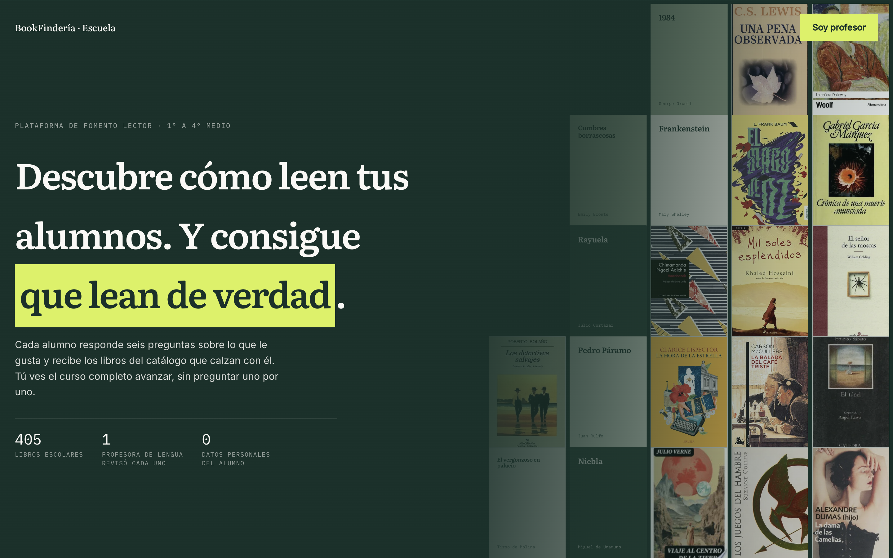
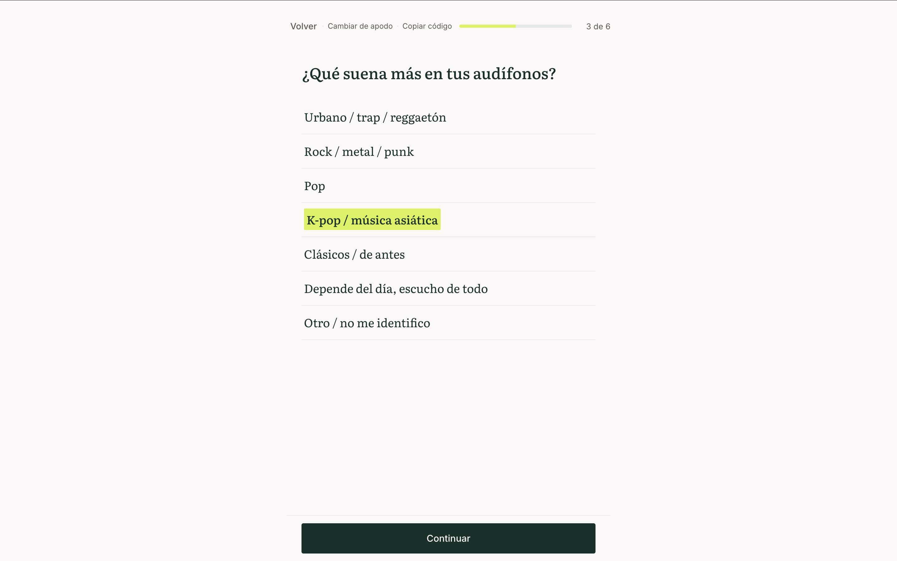
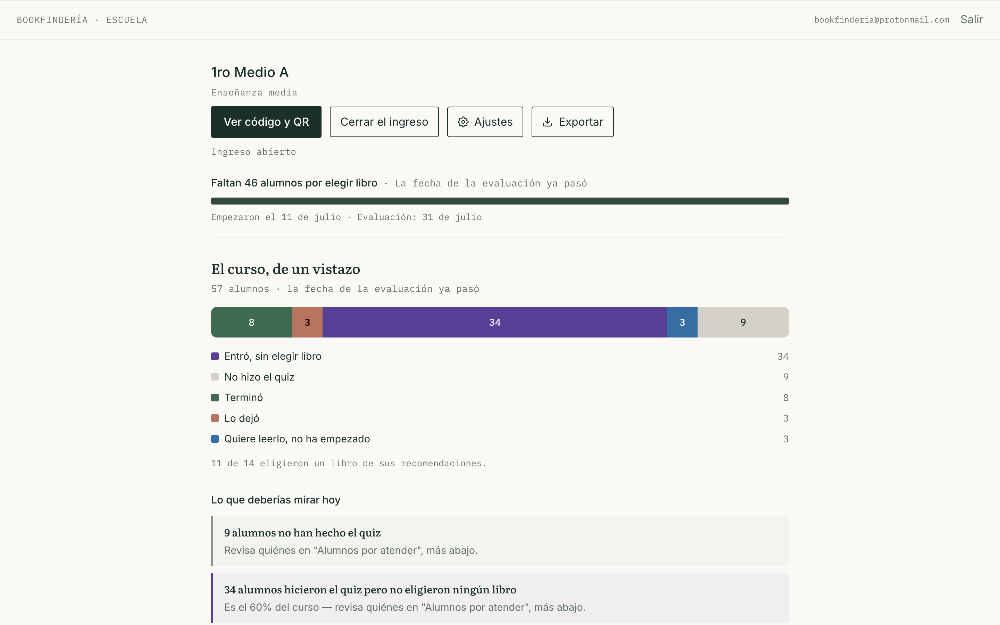

# BookFindería Escuela — Technical Case Study

BookFindería Escuela is a production B2B reading engagement platform for Chilean high schools.

It helps students discover books aligned with their interests while giving teachers visibility into reading choices, progress, and abandonment patterns.

[View the live product](https://bookfinderia.cl/escuela)

> This repository contains a public technical case study. The production source code remains private because it includes commercial code, internal documentation, and shared infrastructure.

## My role

I am the founder and sole product engineer behind BookFindería Escuela.

I worked across the complete product lifecycle:

- Product discovery and scope definition
- UX and interface design
- Frontend development
- Database architecture
- Security and privacy
- Recommendation logic
- Deployment and production verification
- Catalog engineering
- Technical documentation
- AI-assisted development workflows

## The problem

Many schools assign reading plans without a clear view of student interests, reading progress, or why students abandon books.

BookFindería Escuela was designed around one practical goal defined by a working language teacher:

> “No student should be left without choosing a book.”

The platform does not begin by testing literary knowledge. It begins by listening to students through a short interest-based quiz.

## What I built

### Student experience

- Anonymous access through QR codes
- No email, national ID, or real name required
- Six-question interest-based quiz
- Three personalized book recommendations
- Explanations based on actual quiz signals
- Book details, availability, and acquisition guidance
- Reading status tracking
- Persistent sessions
- Explicit confirmation before changing books

### Teacher experience

- Registration, login, password recovery, and Google authentication
- Course creation and QR projection mode
- Classroom dashboard
- Reading-progress visibility
- Alerts based on exceptions
- Book-level teacher guides
- Student alias management
- Reading abandonment reasons
- Assessment creation and printable tests
- Course access controls validated on the server

### Administration

- School and teacher visibility
- Single-use invitation codes
- Session recovery
- Metrics and anomaly detection
- Retry logic with backoff for failed writes

## Product walkthrough

### Public landing

The landing page explains the product to school leaders and teachers, presenting the reading problem, the curated catalog, and the privacy model.

### Student quiz

Students answer six questions about their interests and preferences. The quiz does not test literary knowledge.

### Personalized recommendations

The recommendation engine returns books aligned with the student's answers and provides a direct path to choosing one.

### Teacher dashboard

Teachers can see classroom progress, identify students who need attention, and review reading status without asking every student individually.

## Architecture

The platform is built inside the same repository and database as the consumer BookFindería product.

This avoided duplicating infrastructure, catalog logic, and maintenance work, but introduced a strict isolation requirement:

> A student or teacher inside `/escuela` must not accidentally reach consumer-facing content.

To enforce this:

- School-specific components were created instead of importing consumer UI
- Shared routes and navigation were audited
- Compiled JavaScript bundles were searched for unintended imports
- Complete production flows were tested with browser automation
- Cross-product changes were reviewed before deployment

## Technology stack

- React
- TypeScript
- Vite
- Tailwind CSS
- Supabase
- PostgreSQL
- Row Level Security
- Cloudflare Pages
- Git
- Git worktrees
- Automated browser testing
- Claude Code
- Cursor
- ChatGPT

## Technical documentation

- [System architecture](docs/architecture.md)
- [AI-assisted engineering workflow](docs/ai-assisted-workflow.md)

## Privacy by design

Students are anonymous by architecture.

The platform does not collect:

- Email addresses
- National identification numbers
- Real names
- Student accounts

Students participate using self-selected aliases, while teachers can correct inappropriate aliases without losing the associated reading data.

This decision reduced legal exposure and became a commercial advantage for schools preparing for stronger Chilean data-protection requirements.

## Selected engineering results

- Expanded the active school catalog from 14 to **405 books**
- Cross-referenced the catalog with official education sources and reading plans from **23 Chilean schools**
- Generated and verified **162 teacher guides**
- Corrected **131 production book covers**
- Identified and fixed poor descriptions affecting **44% of the initial school catalog**
- Reduced image-loading latency from approximately **0.52–0.63 seconds to 0.025 seconds** for locally available covers
- Detected a shared image-path issue affecting **100% of the school catalog grid**
- Audited interactive elements across more than 10 screens
- Found and corrected **20 accessibility failures across 12 files**
- Reduced a 44-student mobile dashboard from approximately **3,800px to 1,470px** in height when collapsed

## Engineering case studies

Several incidents shaped the engineering practices used in the project:

### A data point that was almost published incorrectly

A reading statistic was nearly published using a mathematics result from the same assessment.

The mistake was prevented by a project rule:

> No public statistic is published without a primary source verified in extractable text.

### The bug that was not a bug

A reported “broken scroll” could not be reproduced technically.

Browser instrumentation confirmed that scrolling worked correctly. The real problem was affordance: the interface did not communicate that more content existed below.

The solution was visual rather than behavioral.

### A cosmetic loading issue that revealed a performance problem

A blank book-cover placeholder led to the discovery that the entire school catalog grid was using an external proxy, even when optimized local images existed.

The final correction made locally available covers approximately 20 times faster.

### A repeated contrast issue that became a system audit

Three visually weak interactive elements appeared in one day.

Instead of applying another isolated patch, the full interface was audited using WCAG contrast calculations. Twenty failures were found across twelve files and corrected under one shared standard.

## AI-assisted engineering workflow

The project was developed using two Claude Code sessions operating in parallel through separate Git worktrees:

- Consumer application
- School platform

The sessions shared infrastructure and data, so coordination was managed through a documented protocol.

AI tools were used for:

- Repository analysis
- Implementation
- Alternative evaluation
- Debugging support
- Test generation
- Documentation
- Catalog-quality workflows

They were not allowed to make autonomous production decisions.

Human approval remained required for:

- Architecture
- Database changes
- Deployment
- Product scope
- Data interpretation
- Production verification

## Verification practices

A change was not considered complete only because it existed in the repository.

Production verification included:

- Comparing local and deployed bundle hashes
- Testing routes individually
- Running browser automation against the production domain
- Reviewing screenshots visually
- Querying the live database
- Removing test data and confirming cleanup independently

## Current status

The product is deployed in production and functionally complete for its first school pilot.

The remaining dependency is the school calendar and pilot date, not a blocking technical issue.

## Links

- [BookFindería Escuela](https://bookfinderia.cl/escuela)
- [BookFindería](https://bookfinderia.cl)
- [HaikuFlow](https://haikuflow.com)
- [LinkedIn](https://www.linkedin.com/in/victorurrutiacisterna/)
- [Email](mailto:hola@haikuflow.com)

## Repository scope

This repository intentionally does not include:

- Production source code
- Database credentials
- Internal SQL
- School or student data
- Commercial documents
- Private operational documentation
- Complete catalog datasets

Additional architecture notes, diagrams, screenshots, and engineering case studies will be added progressively.
