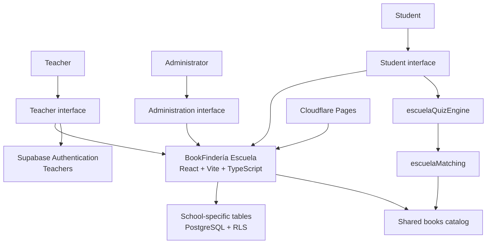

# System architecture

## Context

BookFindería contains two related products:

- **BookFindería**, a consumer-facing literary recommendation platform
- **BookFindería Escuela**, a B2B reading platform for Chilean high schools

Both products currently live in the same source repository and share the same PostgreSQL database.

This decision avoids duplicating:

- Catalog data
- Database infrastructure
- Deployment configuration
- Maintenance work
- Low-level utilities

The main architectural constraint is strict product isolation:

> A student or teacher using `/escuela` must not accidentally reach consumer-facing content or functionality.

## System overview

## Frontend architecture

The school platform uses dedicated interfaces for three user types.

### Student

- Anonymous access through a course URL or QR code
- Self-selected alias instead of a real identity
- Six-question interest-based quiz
- Personalized recommendations
- Book selection and reading-progress updates

### Teacher

- Supabase authentication
- Course creation and management
- QR projection and sharing
- Classroom dashboard
- Student progress and exception alerts
- Teacher guides and assessment tools

### Administrator

- School and teacher visibility
- Single-use invitation codes
- Session recovery
- Platform metrics and anomaly detection

## Product isolation

The school application does not reuse consumer-facing interface components that could expose inappropriate content or navigation.

Dedicated school components were created instead of importing consumer components such as:

- Navigation
- Layout
- Footer
- Book cards
- Book modals
- Purchase links

Isolation was verified through:

- Import-graph analysis
- Searches across compiled JavaScript bundles
- Automated browser navigation
- Manual production walkthroughs

This process identified and corrected real cross-product leaks, including exit actions that returned users to the consumer application.

## Data architecture

The school product uses:

- Five core tables with the `escuela_*` prefix
- `escuela_pruebas`
- `escuela_bdescolar`
- The shared `books` catalog table

Row Level Security is enabled on the school-specific data model.

Policies were verified against the live database rather than inferred only from application code.

## Anonymous student model

Students do not provide:

- Email addresses
- National identification numbers
- Real names
- Personal accounts

A student is represented through a self-selected alias and a persistent session.

Teachers can rename an inappropriate alias without losing the student's associated reading data.

This model reduces the amount of personal data processed by the platform and makes privacy a structural property rather than an optional feature.

## Shared catalog

The `books` table is shared between the consumer and school products.

This provides:

- One source of truth for book metadata
- Shared catalog maintenance
- Reuse of cover and content infrastructure
- Lower operational overhead

It also creates coordination risk.

Any schema change, bulk activation, or catalog update can affect both products, so shared-data changes require explicit review before deployment.

## Recommendation-engine isolation

BookFindería Escuela has its own recommendation logic:

- `escuelaQuizEngine.ts`
- `escuelaMatching.ts`

These are separate from the consumer recommendation engine.

The separation prevents a change to the public consumer algorithm from silently altering the recommendations shown to students in real classrooms.

## Database migration safety

The repository contains different migration histories associated with shared infrastructure.

Because of this, unrestricted migration commands can be unsafe.

The documented operational rules are:

1. Do not run `supabase db push`
2. Apply reviewed DDL through `supabase db query --file`
3. Keep the SQL file in version control as documentation
4. Do not run migration repair automatically
5. Treat migration-history reconciliation as a human decision

These rules were introduced after repeated evidence that automated migration reconciliation could affect shared production infrastructure.

## Deployment

The frontend is built with:

- React
- Vite
- TypeScript
- Tailwind CSS

It is deployed through Cloudflare Pages.

Production deployment requires explicit human approval.

Parallel deployments are avoided because both products share infrastructure and deployment artifacts.

## Production verification

A change is not considered complete only because it exists in the repository.

Verification includes:

- Comparing local and deployed bundle hashes
- Testing production routes individually
- Running browser automation against the live domain
- Reviewing screenshots visually
- Querying the production database
- Removing test records
- Confirming cleanup through a separate query

## Architectural trade-offs

| Decision | Benefit | Risk | Control |
|---|---|---|---|
| Shared repository | Less duplicated maintenance | Cross-product coupling | Dedicated school components |
| Shared database | Single catalog source | Changes can affect both products | Explicit coordination protocol |
| Anonymous students | Minimal personal-data exposure | Session and alias recovery complexity | Teacher-managed aliases and persistent sessions |
| Separate recommendation engine | Stable classroom behavior | Some duplicated logic | Intentional domain isolation |
| AI-assisted development | Faster investigation and implementation | Incorrect autonomous actions | Human review and deployment approval |

## Current limitations

The present architecture is appropriate for the pilot stage, but should be reevaluated if:

- Multiple schools begin using the platform concurrently
- The team grows
- Independent deployment cycles become necessary
- Shared database changes become a recurring bottleneck
- Product-specific scaling requirements diverge

At that point, separating deployment pipelines or services may become justified.

## Repository boundary

This public document intentionally excludes:

- Production credentials
- Complete table schemas
- Row Level Security policy definitions
- Internal SQL files
- Private application code
- School or student data
- Deployment secrets
